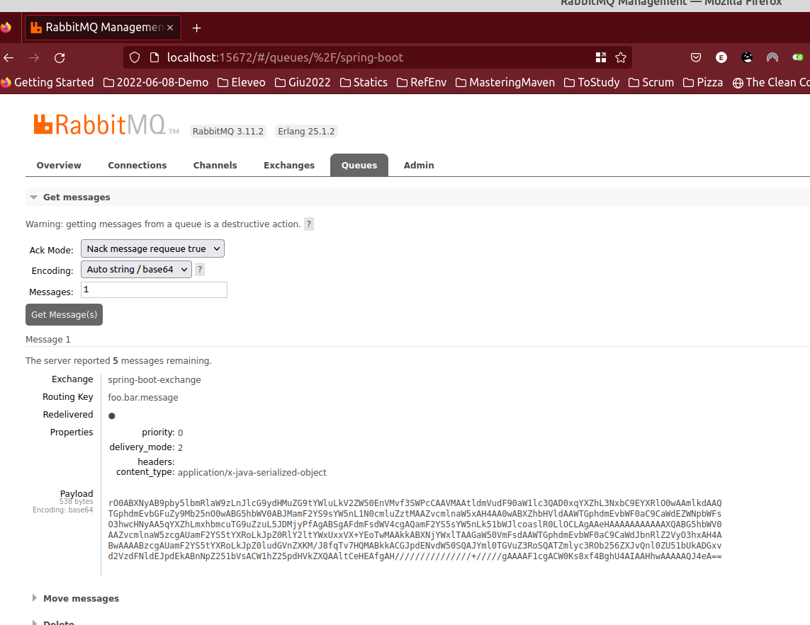

# CQRS messaging with rabbit

The default mode for sending objects to the exchange is byte serialization.
This is how it looks like in the exchange


| Property        | value                                  |
|-----------------|----------------------------------------|
| `priority`      | `0`                                    |
| `delivery_mode` | `2`                                    |
| `content_type`  | `application/x-java-serialized-object` |


## Excluding Configurations from spring context

In order to simplify the context loading, some autoconfigurations can be excluded.
Quite UN-INTUITIVELY one has to declare autoconf and exclude.
This makes sense tho, as autoconf is on by default, and is
somewhat clear that we are actually configuring

```java

@SpringBootTest(classes = MessagingContext.class) //base context, not needed
@EnableAutoConfiguration(exclude = {DataSourceAutoConfiguration.class, LiquibaseAutoConfiguration.class}) // Here I am excluding liquibase and JPA ( is a Conditional of DataSource)
@TestPropertySource("classpath:application-messaging.yaml") // Here I configure ONLY the Autoconf I need, and the Context comes up
public class MessagingTest {
    ...
}
```

### Links
- https://www.baeldung.com/spring-boot-exclude-auto-configuration-test
- [List of the Spring's Autoconfs with their classnames](https://docs.spring.io/spring-boot/docs/current/reference/html/auto-configuration-classes.html) (Both reference for autoconf inspiration and exclusion)
- https://spring.io/projects/spring-data-jpa
- https://github.com/spring-projects/spring-boot/blob/v2.7.5/spring-boot-project/spring-boot-autoconfigure/src/main/java/org/springframework/boot/autoconfigure/jdbc/DataSourceAutoConfiguration.java
- https://github.com/spring-projects/spring-boot/blob/v2.7.5/spring-boot-project/spring-boot-autoconfigure/src/main/java/org/springframework/boot/autoconfigure/liquibase/LiquibaseAutoConfiguration.java
- https://medium.com/@india.jai/springboot-jpa-application-properties-for-various-databases-459a59f6ae7b

### Links for JMS

- https://www.oracle.com/technical-resources/articles/java/intro-java-message-service.html
- https://www.javatpoint.com/jms-tutorial
- https://www.baeldung.com/spring-jms
- https://www.baeldung.com/spring-jms-testing
- [Note that the normal implementation for JMS with Sprint is an embedded ActiveMQ](https://github.com/eugenp/tutorials/tree/master/spring-jms/src/main/resources)
- [Getting started for ActiveMQ](https://activemq.apache.org/getting-started)
- https://activemq.apache.org/run-broker
- https://activemq.apache.org/broker-uri
- [Start an embedded broker](https://activemq.apache.org/how-do-i-embed-a-broker-inside-a-connection)