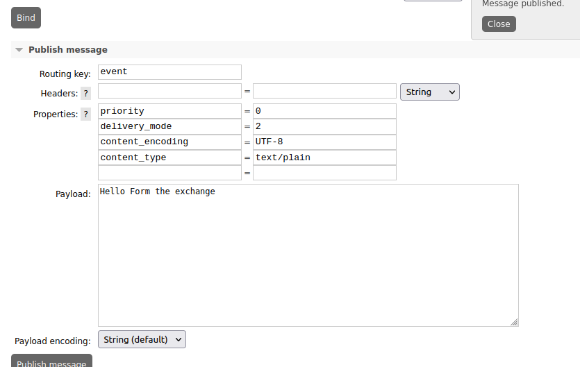

# Basic reports module

A basic reports module, just api no GUI

## The reports database

The reports database stores the calculation events

| Datetime                                    | Origin of the calculation             | name of the calculation                          | calculated value |
|---------------------------------------------|---------------------------------------|--------------------------------------------------|------------------|
| 2022-10-29T10:20:52-CEST (in utc of course) | calculation module "myWeatherStation" | current degrees in my flat ("temperature")       | 19               |
| 2022-10-29T10:23:28-CEST (in utc of course) | calculation module "myWeatherStation" | current humidity in my flat ("humidity_percent") | 56               |

this way one can do calculations and visualize the list of possible things that one can observe, ask for statistics
bla bla bla

## The message format at exchange level
Spring has a sort of format to send messages to the exchange, so, in order to send events and still use
the simple configuration from spring, one has to set some parameters.
Nothing major, all makes sense, it is enough to know.

| Property           | value        |
|--------------------|--------------|
| `priority`         | `0`          |
| `delivery_mode`    | `2`          |
| `content_encoding` | `UTF-8`      |
| `content_type`     | `text/plain` |

### How does a spring message looks like in a queue

### How does a completed form for spring template looks like on rabbit form

## Message format for the system

The messages are supposed to be in form

`<source>:<name>:<value>`

Details in [SendMessageNoSpring.java](src/main/java/io/endeios/reports/SendMessageNoSpring.java)

# Links
## The Spring starter
- https://start.spring.io/
## Liquibase and database
- https://stackoverflow.com/questions/41960588/liquibase-migration-on-startup-doesnt-work-using-spring-boot
- https://dbeaver.io/download/
- https://eliedhr.medium.com/evolving-your-database-in-a-spring-boot-application-with-liquibase-709aad8336c8
- https://github.com/abdalrhmanAlkraien/Liquibase-and-springboot/blob/main/src/main/resources/db/changelog/changelog-master.yml
- https://medium.com/codex/liquibase-tutorial-3ea08691a7a9
- https://docs.liquibase.com/concepts/introduction-to-liquibase.html
- https://docs.liquibase.com/tools-integrations/springboot/springboot.html
- https://juliuskrah.com/tutorial/2017/02/26/database-migration-with-liquibase-hikaricp-hibernate-and-jpa/
## ShellScripting
- https://sharats.me/posts/shell-script-best-practices/
## Rabbit and messaging
- https://hub.docker.com/_/rabbitmq/
- https://javatodev.com/lombok-spring-boot/
- https://spring.io/guides/gs/messaging-rabbitmq/
## Console apps
- https://www.baeldung.com/spring-boot-console-app
## HATEOAS and HAL 

| Name    | explanation                                    |
|---------|------------------------------------------------|
| HATEOAS | Hyper Media As The Engine Of Application State |
| HAL     | Hyper Text Application Language                |

- https://docs.spring.io/spring-hateoas/docs/current/reference/html/#fundamentals.obtaining-links.entity-links
- https://docs.spring.io/spring-hateoas/docs/current/reference/html/
- https://www.baeldung.com/spring-hateoas-tutorial
- https://docs.spring.io/spring-security/site/docs/5.0.x/reference/html/test-mockmvc.html
- https://reflectoring.io/spring-boot-web-controller-test/
- https://datatracker.ietf.org/doc/html/draft-kelly-json-hal#section-4.1.2
- https://stackoverflow.com/questions/25819477/relationship-and-difference-between-hal-and-hateoas
- http://restfulapi.io/hateoas-in-rest-service/